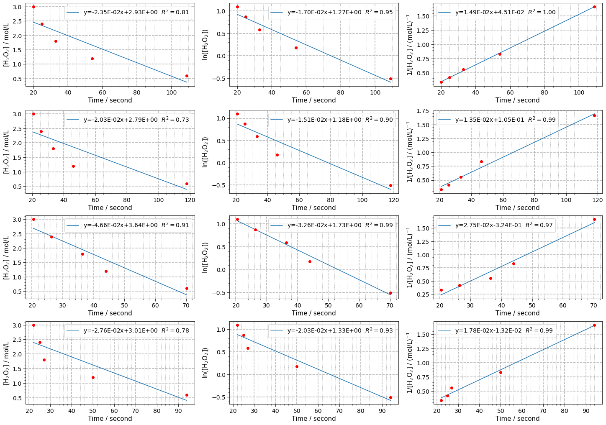

# Kinetics analyser

Analyses chemical kinetics data.

This project analyses chemical kinetics data from lab experiments.

## Installation

Just clone or download this repo. This is not a package (yet, maybe someday :-))

## Usage

See the [tutorial file](kinetics_analyser_tutorial.ipynb).

## Under the hood - requirements

This project relies mainly on [SciPy](https://www.scipy.org/),
[Matplotlib](https://matplotlib.org/), [numpy](https://numpy.org/),
[pandas](https://pandas.pydata.org/) and
[uncertainties](https://pythonhosted.org/uncertainties/).

## Contributing

All contributions are welcome.

**Issues**

Feel free to submit issues regarding:

- recommendations
- more examples for the tutorial
- enhancement requests and new useful features
- code bugs

**Pull requests**

- before starting to work on your pull request, please submit an issue first
- fork the repo
- clone the project to your own machine
- commit changes to your own branch
- push your work back up to your fork
- submit a pull request so that your changes can be reviewed

## License

MIT, see [LICENSE](LICENSE)

## Citing

If you use this project in a scientific publication or in classes, please
consider citing as

F. L. S. Bustamante, *Kinetics analyser*, 2020 - Available at:
https://github.com/chicolucio/kinetics_analyser